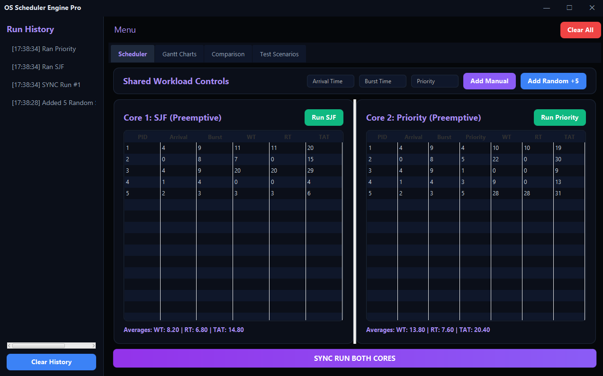
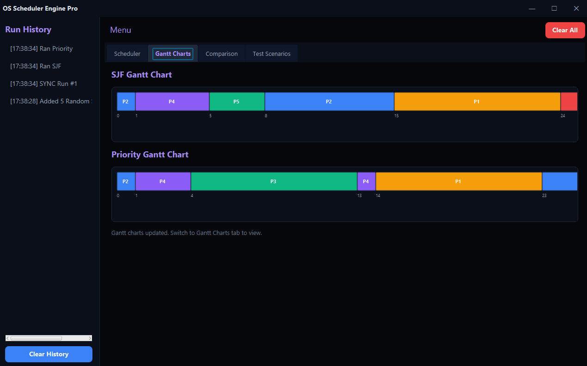
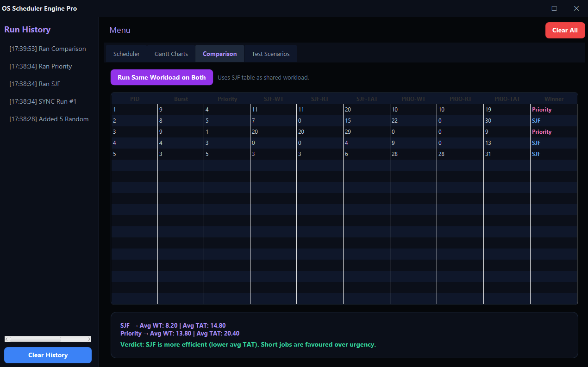
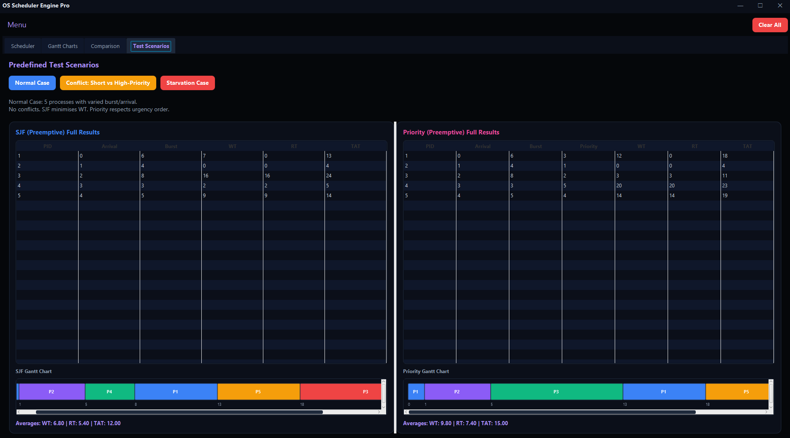
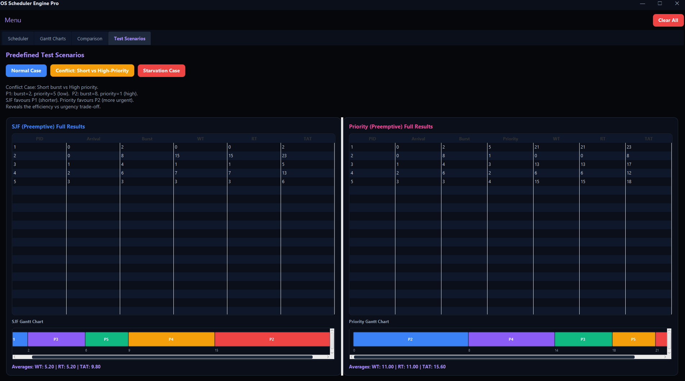
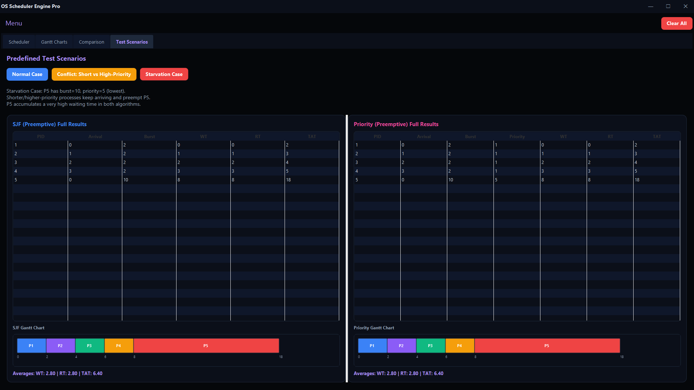
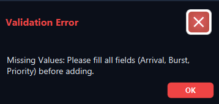
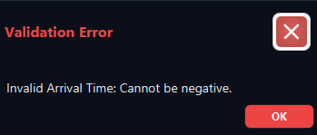

# OS Scheduler Simulator — SJF vs Priority


**Faculty of Computing and Artificial Intelligence**
**Capital University** *~(Formerly Helwan University)*

**Course:** Operating Systems -1                     
**Instructor:** Prof. Ahmed Hisham                   
**Academic Year:** 2025/2026

---

## Project Overview

The OS Scheduler Simulator is an interactive desktop application designed to evaluate and compare CPU scheduling algorithms. Specifically, this project implements and contrasts **Preemptive Shortest Job First (SJF)** against **Preemptive Priority Scheduling**. The system provides visual Gantt charts and computes essential performance metrics to analyze the trade-offs between system efficiency (SJF) and task urgency (Priority).

---

## Technologies & Architecture

| Layer                | Technology / Pattern                                          |
|----------------------|---------------------------------------------------------------|
| Language             | Java (JDK 21+)                                                |
| GUI Framework        | JavaFX                                                        |
| Build Tool           | Gradle (for dependency management and build automation)       |
| Architecture         | Clean Architecture (Model-Scheduler-GUI separation)           |
| Design Patterns      | Strategy (for schedulers), Factory, Observer                  |
| Version Control      | Git + GitHub (branching strategy enforced)                    |

---

Direct Download Link:
[Download sjf_priority.exe](https://raw.githubusercontent.com/abdelhalimyasser/sjf-priority-scheduler-simulator/main/sjf_priority.exe)

---

## Project Structure

The repository follows the strict separation of concerns required by the OS Algorithm Comparison guidelines
```
├── .idea/
│   ├── .gitignore
│   ├── .name
│   ├── gradle.xml
│   ├── misc.xml
│   ├── vcs.xml
│   └── workspace.xml
├── gradle/
│   └── wrapper/
│       ├── gradle-wrapper.jar
│       └── gradle-wrapper.properties
├── images/
│   ├── comparison.png
│   ├── gantt-chart.png
│   ├── input-error.png
│   ├── main-interface.png
│   ├── negative-input.png
│   ├── test-conflict.png
│   ├── test-normal.png
│   └── test-starvation.png
├── src/
│   └── main/
│       ├── java/
│       │   ├── com/
│       │   │   └── sjf_priority/
│       │   │       ├── contract/
│       │   │       │   └── CpuScheduler.java
│       │   │       ├── controllers/
│       │   │       │   └── MainController.java
│       │   │       ├── model/
│       │   │       │   ├── ComparisonRow.java
│       │   │       │   ├── ExecutionRecord.java
│       │   │       │   └── Process.java
│       │   │       ├── scheduler/
│       │   │       │   ├── PriorityScheduling.java
│       │   │       │   └── SJF.java
│       │   │       ├── App.java
│       │   │       └── Launcher.java
│       │   └── module-info.java
│       └── resources/
│           └── com/
│               └── sjf_priority/
│                   ├── css/
│                   │   └── style.css
│                   ├── fxml/
│                   │   └── MainView.fxml
│                   └── images/
│                       └── icon.png
├── .gitignore
├── app_history.txt
├── build.gradle.kts
├── gradlew
├── gradlew.bat
├── LICENSE
├── README.md
├── settings.gradle.kts
├── sjf_priority.exe
└── src - Shortcut.lnk
```

---

## Screenshots

### Main Interface



### GANTT Chart Comparison



### Evaluation Rubrics & Key Features




### Test Scenarios
| Normal Case | Conflict Case | Starvation Case |
| :---: | :---: | :---: |
|  |  |  |

### Error Handling
| Invalid Input | Negative Values |
| :---: | :---: |
|  |  |

---

## Core Modules & Key Features

The system is structured around the required evaluation rubrics spanning accurate algorithm execution and visualization.

### Input Handling & Validation
- **Dynamic Process Entry** — Add, remove, and modify processes dynamically before execution.
- **Strict Validation** — Rejects invalid numeric inputs, duplicate IDs, missing values, and negative priority/burst values.
- **Unified Workload Loader** — Ensures both algorithms are tested against the exact same dataset for fair comparison.

### Algorithm A: Preemptive SJF
- **Dynamic Shortest Job Selection** — Chooses the process with the shortest available burst time whenever the CPU becomes free.
- **Context Switching Simulation** — Accurately preempts running jobs when a new job with a shorter burst time arrives.
- **Tie-Breaking Protocol** — Documented rules for handling processes with identical remaining burst times (e.g., FCFS).

### Algorithm B: Preemptive Priority
- **Urgency Execution** — Executes jobs based on strict priority values (Lower Value = Higher Priority).
- **Preemption Logic** — Interrupts running processes immediately if a job with a higher priority arrives in the ready queue.
- **Starvation Analysis Ready** — Built to highlight workloads where low-priority tasks face unfair delay.

### Visualization & Metrics Calculation
- **Interactive Gantt Charts** — Renders clear, separate Gantt charts for each algorithm with precise time markers and execution order.
- **Per-Process Metrics** — Calculates WT, TAT, and RT for every individual process.
- **System Averages** — Computes overall system averages consistent with the Gantt chart outputs.
- **Comparison Tables** — Side-by-side metric comparison to reveal the efficiency vs. urgency trade-offs.

---

## Team Members & Responsibilities

| Name              | GitHub                                                      | Contribution Area                 |
|-------------------|-------------------------------------------------------------|-----------------------------------|
| Abdelhalim Yasser | [@abdelhalimyasser](https://github.com/abdelhalimyasser)    | - The Models & Processes<br/>- Frontend |
| Abdelallah Nasser | [@abdallahnasser2005](https://github.com/abdallahnasser2005) | - Priority<br/>- Frontend           |
| Ali Samy          | [@AliSamy12](https://github.com/AliSamy12)                  | - Priority<br/>- Frontend   |
| Nada Moustafa     | [@qNVDV](https://github.com/qNVDV)                          | - SJF<br/>- Frontend              |
| Nourhan Mohamed   | [@Nour-FCAI](https://github.com/Nour-FCAI)                  | - SJF<br/>- Frontend              |
| Nessreen Salah    | [@nesreensalh](https://github.com/nesreensalh)              | - SJF<br/>- Frontend              |

---

## Getting Started

### Prerequisites
- **Java Development Kit (JDK):** Version 21 or higher if released.
- **JavaFX SDK:** Compatible with your JDK version and managed via Gradle.
- **IDE:** IntelliJ IDEA (Recommended), Apache / Oracle Netbeans, Eclipse, VS Code.

---

### Running the Project

#### 1. Clone the repository
```bash
git clone https://github.com/abdelhalimyasser/sjf-priority-scheduler-simulator.git
cd sjf-priority-scheduler-simulator
```

#### 2. Open in IntelliJ IDEA or your fav. IDE

#### 3. Configure JavaFX (If not using Maven/Gradle)

#### 4. Run the Main Application
```bash
src/gui/Main.java
```

---

<p align="center">
  <strong>FCAI – Capital University ~ (Formerly Helwan University)</strong><br>
  Operating Systems · Algorithm Comparison Project · 2025/2026
  <br>
  <span>© 2026 <strong>OS Team</strong>. All Rights Reserved.</span>
  Released under the <a href="LICENSE"><code>LICENSE</code></a>.
</p>
